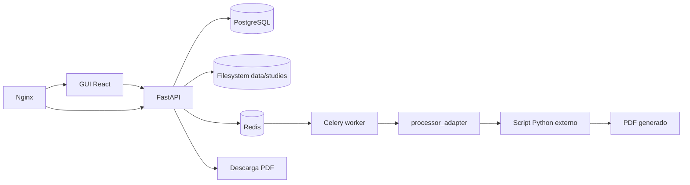

# neuroimagen-server-biocruces

Repositorio para el TFM **"Diseño e implementación de un servicio de procesamiento de imágenes de resonancia magnética para la generación automática de informes clínicos en Neurorrehabilitación"**.

La plataforma permite subir estudios anonimizados desde una GUI web, registrar la subida, lanzar procesamiento asíncrono mediante un script Python externo tratado como caja negra, guardar estados y descargar el PDF generado.

## Arquitectura Resumida



## Requisitos

- Docker y Docker Compose.
- Make opcional para comandos cómodos.
- Uso inicial con datos anonimizados.

## Arranque Rápido

```bash
cp .env.example .env
make up
```

Abrí `http://localhost` para la GUI y `http://localhost/api/docs` para Swagger/OpenAPI.

## Comandos Principales

```bash
make up       # levantar servicios
make down     # parar servicios
make logs     # ver logs
make test     # ejecutar tests Python locales
make lint     # ruff check
make format   # ruff format
make migrate  # aplicar migraciones en el contenedor api
make seed     # crear fichero de prueba local
make smoke    # comprobar healthcheck vía proxy
make clean    # borrar volúmenes y estudios locales
```

## Flujo Funcional

1. El usuario sube un fichero desde la GUI.
2. FastAPI valida extensión, sanitiza nombre y guarda el fichero en `data/studies/{study_id}/input`.
3. Se crea un `Study`, un `ProcessingJob` y eventos de auditoría.
4. FastAPI encola una tarea Celery en Redis.
5. El worker ejecuta `processor_adapter`.
6. El adaptador invoca el comando configurado en `PROCESSOR_COMMAND`.
7. El script externo genera un PDF en `output`.
8. El worker detecta el PDF, actualiza estado y guarda logs.
9. La GUI permite descargar el PDF.

## Integrar El Script Real

No modifiques la aplicación para acoplarla al script. Cambiá `.env`:

```env
PROCESSOR_COMMAND=python /app/external_processor/process.py --input {input_dir} --output {output_dir} --study-id {study_id}
```

Placeholders disponibles: `{input_dir}`, `{output_dir}`, `{study_id}`, `{logs_dir}`.

## Estructura

```text
backend/              API FastAPI, modelos, migraciones
frontend/             GUI React/Vite
worker/               tareas Celery
processor_adapter/    adaptador CLI desacoplado
external_processor/   procesador dummy de desarrollo
infra/reverse-proxy/  Nginx
docs/                 documentación TFM y operación
scripts/              scripts de operación y validación
tests/                tests básicos
data/studies/         almacenamiento local ignorado por Git
```

Cada carpeta de primer nivel incluye su propio `README.md` explicando para qué sirve y cómo está organizado su código o contenido.

## Limitaciones Iniciales

- Sin usuarios ni login.
- Sin anonimización DICOM integrada.
- Sin roles ni revisión clínica formal.
- Sin retención automática de datos.
- Sin MinIO/S3 en esta versión.
- El procesador dummy no tiene validez clínica.

## Roadmap

El roadmap detallado está en `docs/roadmap.md` e incluye autenticación, roles, múltiples herramientas, MinIO/S3, TLS real, CI/CD, monitorización, retención y validación clínica.
