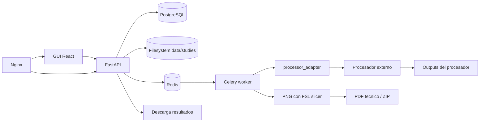

# neuroimagen-server-biocruces

Repositorio para el TFM **"Diseño e implementación de un servicio de procesamiento de imágenes de resonancia magnética para la generación automática de informes clínicos en Neurorrehabilitación"**.

La plataforma permite subir estudios anonimizados desde una GUI web, registrar la subida, preparar una estructura BIDS por estudio, lanzar procesamiento asíncrono mediante un procesador externo tratado como caja negra, guardar estados y descargar un PDF técnico y, cuando aplica, un ZIP de outputs.

El PDF generado en esta versión es un **informe técnico de artefactos de procesamiento**. No interpreta imágenes, no contiene conclusiones médicas y no constituye un informe clínico validado.

## Arquitectura Resumida



## Requisitos

- Docker y Docker Compose.
- Make opcional para comandos cómodos.
- Uso inicial con datos anonimizados.

## Arranque Rápido

```bash
cp .env.example .env
make up
```

Abre `http://localhost` para la GUI y `http://localhost/api/docs` para Swagger/OpenAPI.

## Comandos Principales

```bash
make up       # levantar servicios
make down     # parar servicios
make logs     # ver logs
make test     # ejecutar tests Python locales
make lint     # ruff check
make format   # ruff format
make migrate  # aplicar migraciones en el contenedor api
make seed     # crear fichero de prueba local
make smoke    # comprobar healthcheck vía proxy
make clean    # borrar volúmenes y estudios locales
```

## Flujo Funcional

1. El usuario sube un fichero desde la GUI.
2. FastAPI valida extensión, sanitiza nombre y guarda el fichero en `data/studies/{study_id}/input`.
3. Se crea un `Study`, un `ProcessingJob` y eventos de auditoría.
4. FastAPI encola una tarea Celery en Redis.
5. El worker ejecuta `processor_adapter`.
6. El adaptador ejecuta el comando correspondiente al backend configurado.
7. En modo `dummy`, se usa `PROCESSOR_COMMAND`; en modo `compneuro`, se usa `COMPNEURO_COMMAND`.
8. El procesador dummy genera un PDF de desarrollo o `compneuro-anatproc` genera `Preproc/BET` y `Preproc/ProbTissue`.
9. El worker detecta outputs, renderiza NIfTI a PNG con FSL `slicer`, genera un PDF técnico y opcionalmente un ZIP.
10. La GUI permite descargar el PDF técnico y/o el ZIP.

## Procesadores

El backend de procesamiento se selecciona con `PROCESSOR_BACKEND`.

| Backend | Uso | Comando ejecutado |
| --- | --- | --- |
| `dummy` | Desarrollo y pruebas rápidas sin pipeline real. | `PROCESSOR_COMMAND` |
| `compneuro` | Integración real con `compneuro-anatproc` para T1w `.nii.gz`. | `COMPNEURO_COMMAND` |

`PROCESSOR_COMMAND` es una plantilla para el procesador de desarrollo. Permite cambiar el script dummy sin tocar FastAPI ni Celery:

```env
PROCESSOR_COMMAND=python /app/external_processor/process.py --input {input_dir} --output {output_dir} --study-id {study_id}
```

Placeholders disponibles: `{input_dir}`, `{output_dir}`, `{study_id}`, `{logs_dir}`.

Para `compneuro`, el worker debe construirse con `WORKER_DOCKERFILE=worker/Dockerfile.compneuro` y `PROCESSOR_BACKEND=compneuro`. En este modo el comando relevante es:

```env
COMPNEURO_COMMAND=bash /app/src/apreproc_launcher.sh
```

No se usa Docker-in-Docker: Celery corre dentro de una imagen derivada de `compneurobilbaolab/compneuro-anatproc:1.1`, ejecuta `src/apreproc_launcher.sh` y después usa FSL `slicer` para crear PNG técnicos desde los NIfTI generados.

La carpeta local `compneuro-anatproc/`, si existe en la raíz, es solo una referencia temporal ignorada por Git. La integración real usa la imagen Docker y el build versionado del worker; esa carpeta no es una dependencia permanente y puede eliminarse.

## Estructura

```text
backend/              API FastAPI, modelos, migraciones
frontend/             GUI React/Vite
worker/               tareas Celery
processor_adapter/    adaptador CLI desacoplado
external_processor/   procesador dummy de desarrollo
infra/reverse-proxy/  Nginx
docs/                 documentación TFM y operación
scripts/              scripts de operación y validación
tests/                tests básicos
data/studies/         almacenamiento local ignorado por Git
```

Cada carpeta de primer nivel incluye su propio `README.md` explicando para qué sirve y cómo está organizado su código o contenido.

## Limitaciones Iniciales

- Sin usuarios ni login.
- Sin anonimización DICOM integrada.
- Sin roles ni revisión clínica formal.
- Sin retención automática de datos.
- Sin MinIO/S3 en esta versión.
- El procesador dummy no tiene validez clínica.
- La integración `compneuro-anatproc` inicial ejecuta solo `src/apreproc_launcher.sh`; `brainmeasures.sh` queda como mejora futura.
- El PDF de la integración real es un resumen técnico de procesamiento con PNG renderizados desde outputs NIfTI; no es un informe clínico.

## Roadmap

El roadmap detallado está en `docs/roadmap.md` e incluye autenticación, roles, múltiples herramientas, MinIO/S3, TLS real, CI/CD, monitorización, retención y validación clínica.
