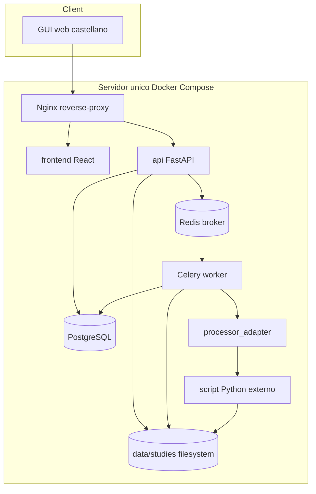
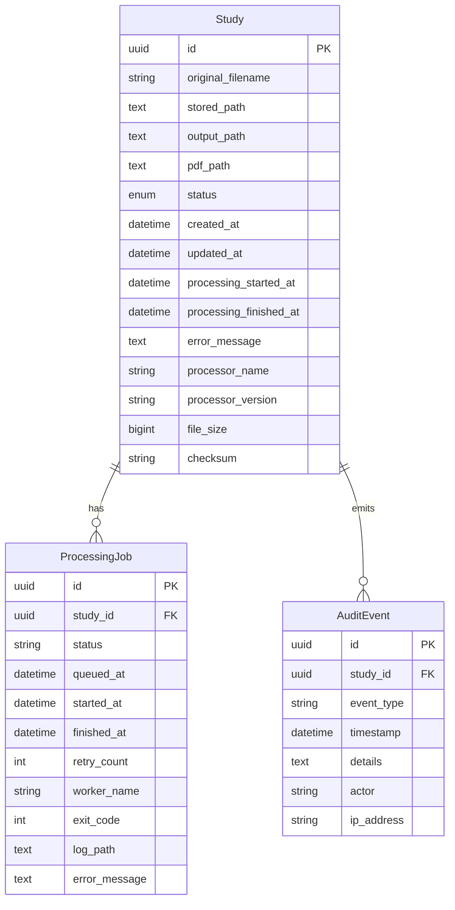
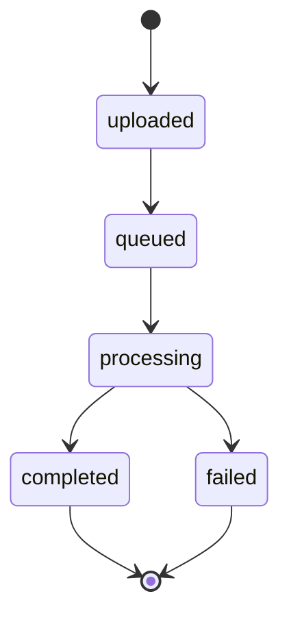

# Arquitectura

El sistema usa una arquitectura desacoplada para evitar que la API web dependa del algoritmo clínico. El script externo se invoca mediante `processor_adapter` como caja negra.

## Componentes

- `frontend`: interfaz simple para subida, listado, estado y descarga.
- `api`: valida entradas, registra estudios, expone OpenAPI y descarga PDFs.
- `worker`: ejecuta tareas largas fuera del ciclo HTTP.
- `processor_adapter`: contrato estable con el script CLI externo.
- `postgres`: persistencia relacional.
- `redis`: cola de tareas.
- `filesystem`: almacenamiento inicial sustituible por S3/MinIO futuro.
- `reverse-proxy`: punto de entrada HTTP.

## Modelo ER

## Estados

Estados futuros documentados: `review_pending`, `reviewed`, `rejected`, `archived`.
