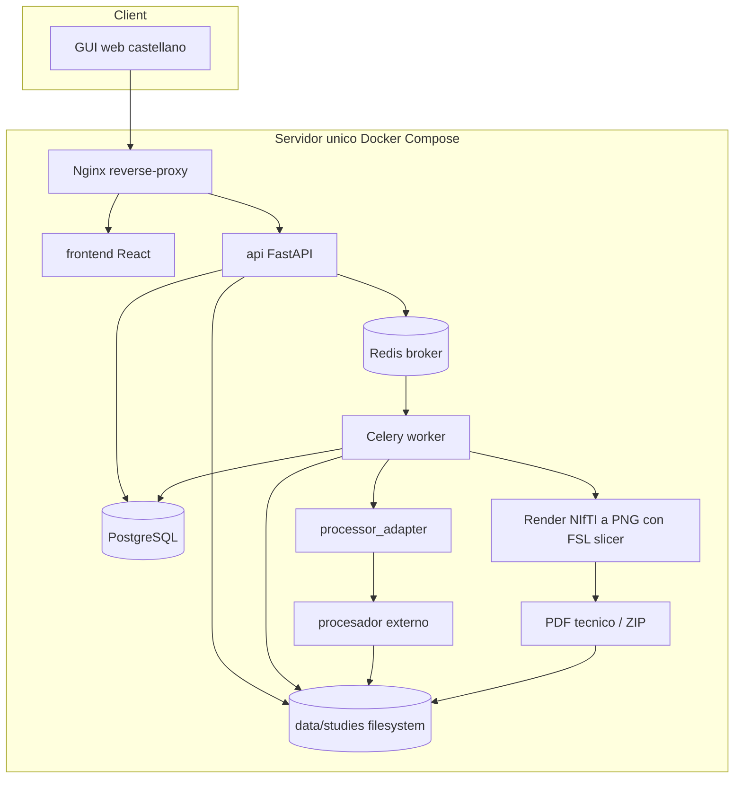
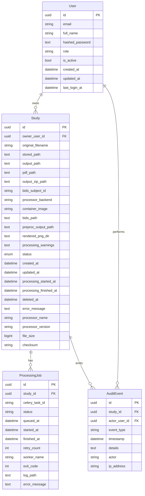
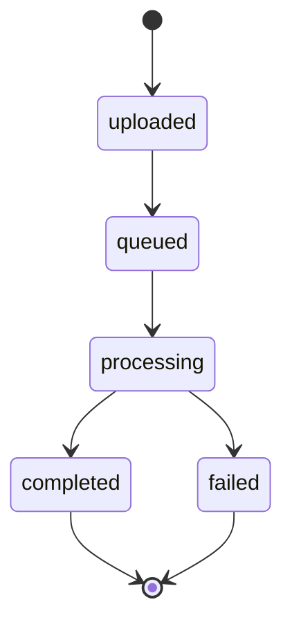

# Arquitectura

El sistema usa una arquitectura desacoplada para evitar que la API web dependa del algoritmo concreto de procesamiento. El procesador externo se invoca mediante `processor_adapter` como caja negra y puede seleccionarse por configuración (`dummy` o `compneuro`).



Para `compneuro-anatproc`, el servicio `worker` puede construirse con `worker/Dockerfile.compneuro`, derivado de `compneurobilbaolab/compneuro-anatproc:1.1`. No se usa Docker-in-Docker: Celery, el launcher externo y FSL `slicer` conviven en el mismo contenedor worker.

No existe un contenedor `compneuro-anatproc` anidado dentro del `worker`. El `worker` es una imagen derivada de `compneurobilbaolab/compneuro-anatproc:1.1`; por eso ejecuta directamente los scripts y herramientas de neuroimagen dentro del mismo contenedor.

Esta decisión no obliga a usar siempre esa imagen ni ese launcher. La frontera mantenible es `processor_adapter`: un futuro procesador puede usar otro script o un worker construido desde otra imagen si respeta el contrato de entrada/salida y deja a la plataforma la trazabilidad, el PDF técnico y el ZIP descargable.

## Componentes

- `frontend`: interfaz simple para subida, listado, estado y descarga.
- `api`: valida entradas, registra estudios, prepara BIDS, expone OpenAPI y descarga PDFs/ZIPs.
- `worker`: ejecuta tareas largas fuera del ciclo HTTP.
- `processor_adapter`: contrato estable con el procesador externo y estrategia por backend.
- `postgres`: persistencia relacional.
- `redis`: cola de tareas.
- `filesystem`: almacenamiento inicial sustituible por S3/MinIO futuro.
- `reverse-proxy`: punto de entrada HTTP.

## Modelo ER

El modelo siguiente refleja el estado implementado actualmente, incluyendo autenticación local y propietario por estudio.



## Arquitectura Multiusuario

La API aplica autenticación y autorización antes de operar sobre estudios. El worker no conoce sesiones ni roles: recibe IDs de estudios ya validados por la API y conserva la frontera con `processor_adapter`.

Reglas implementadas:

- `admin` puede ver todos los estudios y crear usuarios.
- `admin` puede consultar el dashboard operativo global con cola, jobs, uso de disco, healthchecks, usuarios y estudios por estado.
- `researcher` puede subir estudios, ver historial propio y descargar resultados propios.
- Los usuarios iniciales se crean por admin; no hay registro público abierto.
- El usuario admin inicial se crea con `make create-admin EMAIL=...`.
- El pipeline sigue aislado detrás de `processor_adapter`; autenticación y permisos pertenecen a la capa API.

Evolución posterior:

- Un rol `viewer` completo no entra en la implementación actual. La compartición futura debe resolverse con enlaces firmados, caducidad, revocación y auditoría.
- Google/OIDC y ORCID deben vincularse a usuarios internos existentes o aprovisionados, sin sustituir el modelo de permisos propio.
- Backups, restore local y mantenimiento operativo quedan para una fase posterior.

## Estados



Estados futuros documentados: `review_pending`, `reviewed`, `rejected`, `archived`.

La cancelación implementada se limita a trabajos en cola y usa el estado `canceled`. La cancelación de procesos ya en ejecución queda fuera porque requiere gestionar de forma segura procesos externos de FSL/`compneuro`.

No se añade un estado `bids_prepared` en la primera integración: la preparación BIDS ocurre antes de encolar y queda trazada mediante campos y auditoría. Si falla, la subida responde con error y no crea un estudio procesable.

## Worker Compneuro

```mermaid
flowchart LR
  API[FastAPI] --> Data[(data/studies)]
  API --> Redis[(Redis)]
  Redis --> Worker[Celery worker compneuro]
  Worker --> Adapter[CompneuroAnatprocAdapter]
  Adapter --> Project[/project symlink gestionado]
  Project --> BIDS[bids_project/data]
  Project --> Preproc[output/Preproc]
  Adapter --> Launcher[src/apreproc_launcher.sh]
  Launcher --> Preproc
  Worker --> PNG[output/rendered_png]
  PNG --> PDF[output/reports/technical_report.pdf]
  Worker --> ZIP[output/outputs.zip]
```

No se mantiene una copia local de `compneuro-anatproc/` como dependencia del proyecto. El worker real parte de la imagen Docker publicada y, durante el build, copia únicamente los scripts versionados necesarios para ejecutar `src/apreproc_launcher.sh`.

Para reemplazar el procesador, no hace falta modificar FastAPI ni la GUI si se mantiene el contrato. El punto de extensión esperado es crear o ajustar un adapter, cambiar `PROCESSOR_BACKEND`/comando, y construir un worker que incluya las herramientas necesarias.

## Decisiones Arquitectónicas

- La API no ejecuta procesamiento de neuroimagen; valida, prepara datos, registra el estudio y encola la tarea.
- Celery ejecuta el procesamiento largo fuera del ciclo HTTP para evitar bloqueos y permitir trazabilidad de estados.
- `processor_adapter` mantiene al procesador externo como caja negra y evita acoplar FastAPI al pipeline de neuroimagen concreto.
- El post-procesado técnico se ejecuta en el mismo worker porque FSL ya está disponible y se evitan contenedores, volúmenes y sincronización adicionales.
- El PDF generado es técnico y no contiene interpretación de imagen ni conclusiones médicas.
