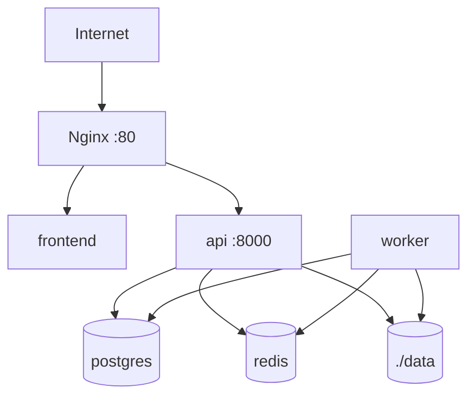

# Despliegue

El despliegue inicial está pensado para un único servidor con Docker Compose.

## Instalación Local

1. Clonar o abrir el repositorio.
2. Crear configuración local con `cp .env.example .env`.
3. Revisar contraseñas, rutas y procesador según `docs/configuration.md`.
4. Levantar servicios con `make up`.
5. Crear el primer admin con `make create-admin EMAIL=admin@example.org`.
6. Acceder a la GUI en `http://localhost` o a Swagger en `http://localhost/api/docs`.

No uses datos reales identificativos o sensibles en esta versión inicial.



## Worker Compneuro

Para ejecutar `compneuro-anatproc`, el worker se construye con `worker/Dockerfile.compneuro`, derivado de `compneurobilbaolab/compneuro-anatproc:1.1`. Ese contenedor contiene Celery, el código de la plataforma y las herramientas de neuroimagen. No se usa Docker-in-Docker.

No se arranca un contenedor `compneuro-anatproc` separado. El servicio `worker` es el contenedor que hereda esa imagen base y ejecuta directamente `src/apreproc_launcher.sh`.

Si en el futuro se usa otro script o una imagen distinta, el patrón se mantiene: el servicio `worker` debe contener Celery, el código de la plataforma, las dependencias del procesador y acceso al volumen `./data:/app/data`. El nuevo comando debe configurarse por variables de entorno y respetar la estructura de resultados esperada documentada en `docs/processing-pipeline.md`.

Variables mínimas:

```env
PROCESSOR_BACKEND=compneuro
PROCESSOR_NAME=compneuro-anatproc
PROCESSOR_VERSION=1.1
WORKER_DOCKERFILE=worker/Dockerfile.compneuro
ALLOWED_EXTENSIONS=.nii.gz
MAX_CONCURRENT_PROCESSING_JOBS=1
```

`api` y `worker` deben compartir `./data:/app/data`, porque la API prepara BIDS y el worker escribe `output/Preproc`, logs, PDF técnico y ZIP.

## Producción Básica

- Cambiar secretos en `.env`.
- Configurar `AUTH_SECRET_KEY` con un valor propio.
- Revisar todas las variables descritas en `docs/configuration.md`.
- Restringir acceso de red al servidor.
- Añadir TLS en Nginx o Caddy.
- Configurar backups de PostgreSQL y `data/`.
- Revisar política de retención antes de usar datos sensibles.
