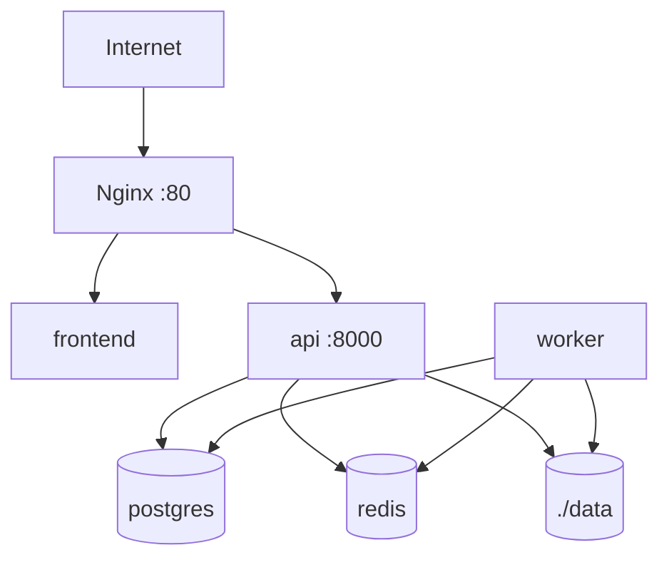

# Despliegue

El despliegue inicial está pensado para un único servidor con Docker Compose.

## Producción Básica

- Cambiar secretos en `.env`.
- Restringir acceso de red al servidor.
- Añadir TLS en Nginx o Caddy.
- Configurar backups de PostgreSQL y `data/`.
- Revisar política de retención antes de usar datos sensibles.
