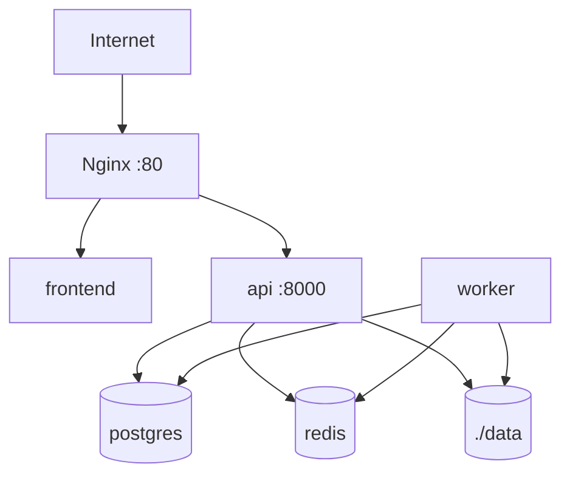

# Despliegue

El despliegue inicial está pensado para un único servidor con Docker Compose.



## Worker Compneuro

Para ejecutar `compneuro-anatproc`, el worker se construye con `worker/Dockerfile.compneuro`, derivado de `compneurobilbaolab/compneuro-anatproc:1.1`. Ese contenedor contiene Celery, el código de la plataforma y las herramientas de neuroimagen. No se usa Docker-in-Docker.

Variables mínimas:

```env
PROCESSOR_BACKEND=compneuro
PROCESSOR_NAME=compneuro-anatproc
PROCESSOR_VERSION=1.1
WORKER_DOCKERFILE=worker/Dockerfile.compneuro
ALLOWED_EXTENSIONS=.nii.gz
MAX_CONCURRENT_PROCESSING_JOBS=1
```

`api` y `worker` deben compartir `./data:/app/data`, porque la API prepara BIDS y el worker escribe `output/Preproc`, logs, PDF técnico y ZIP.

## Producción Básica

- Cambiar secretos en `.env`.
- Revisar todas las variables descritas en `docs/configuration.md`.
- Restringir acceso de red al servidor.
- Añadir TLS en Nginx o Caddy.
- Configurar backups de PostgreSQL y `data/`.
- Revisar política de retención antes de usar datos sensibles.
