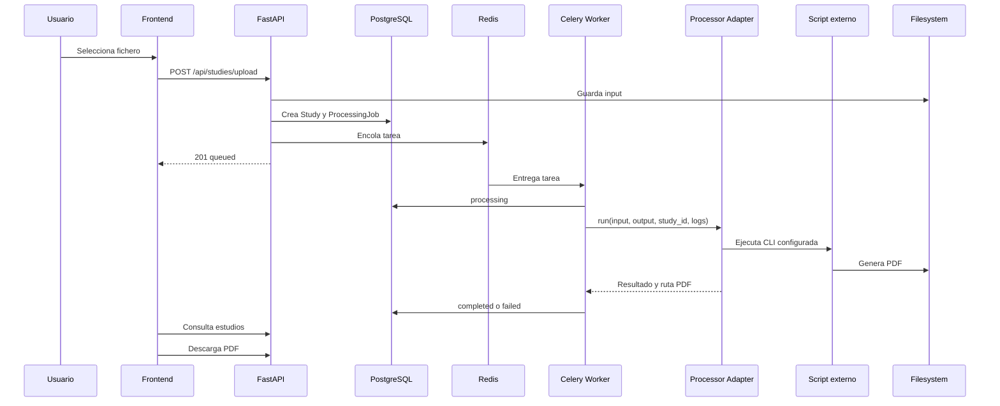

# Pipeline De Procesamiento

El procesamiento tarda entre minutos y una hora, por eso nunca se ejecuta en la petición HTTP.



## Contrato Del Adaptador

Entrada:

- `input_dir`
- `output_dir`
- `study_id`
- `logs_dir`
- `PROCESSOR_COMMAND`

Salida:

- éxito/error.
- código de salida.
- ruta del PDF.
- log técnico.
- mensaje de error.
- duración.

El comando se configura con placeholders:

```env
PROCESSOR_COMMAND=python /app/external_processor/process.py --input {input_dir} --output {output_dir} --study-id {study_id}
```

El adaptador valida entrada, crea salida, captura stdout/stderr, guarda logs, detecta errores y comprueba que se genere al menos un PDF.
