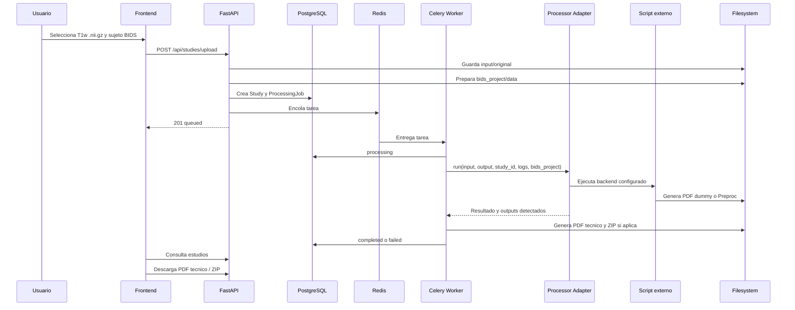
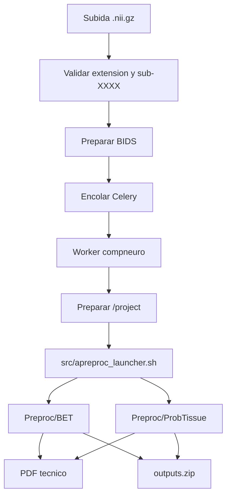

# Pipeline De Procesamiento

El procesamiento tarda entre minutos y una hora, por eso nunca se ejecuta en la petición HTTP. La API prepara datos y encola; el worker ejecuta el procesador configurado.



## Contrato Del Adaptador

Entrada:

- `input_dir`
- `output_dir`
- `study_id`
- `logs_dir`
- backend configurado (`PROCESSOR_BACKEND`)

Salida:

- éxito/error.
- código de salida.
- ruta del PDF, si el backend lo genera o si la plataforma crea un PDF técnico.
- lista de outputs.
- ruta del ZIP, si aplica.
- log técnico.
- mensaje de error.
- duración.

El backend `dummy` ejecuta `PROCESSOR_COMMAND` con placeholders:

```env
PROCESSOR_COMMAND=python /app/external_processor/process.py --input {input_dir} --output {output_dir} --study-id {study_id}
```

El adaptador valida entrada, crea salida, captura stdout/stderr y guarda logs. En `dummy` comprueba que se genere al menos un PDF. En `compneuro` ejecuta `src/apreproc_launcher.sh`, comprueba exit code `0` y valida que existan `Preproc/BET` y `Preproc/ProbTissue`.

## BIDS Por Estudio

```text
data/studies/{study_id}/
  input/original/{fichero_original}.nii.gz
  bids_project/data/sub-XXXX/anat/sub-XXXX_T1w.nii.gz
  bids_project/data/participants.tsv
  bids_project/data/dataset_description.json
  runtime_project/data -> ../bids_project/data
  runtime_project/Preproc -> ../output/Preproc
  output/Preproc/BET
  output/Preproc/ProbTissue
  logs/processor.log
  logs/technical_report.pdf
  outputs.zip
```

`compneuro-anatproc` usa rutas hardcodeadas bajo `/project`. La plataforma crea un `runtime_project` aislado por estudio y el worker compneuro apunta `/project` a esa carpeta mediante symlink gestionado. Esto evita Docker-in-Docker y evita modificar los scripts externos.

## Flujo Compneuro


