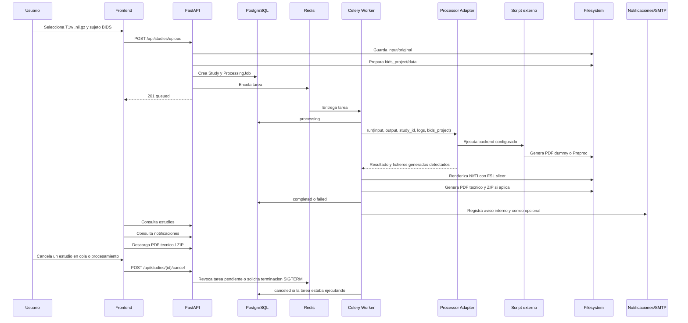
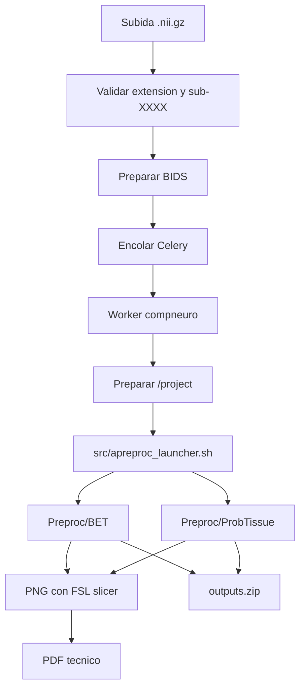

# Pipeline De Procesamiento

El procesamiento tarda entre minutos y una hora, por eso nunca se ejecuta en la petición HTTP. La API prepara datos y encola; el worker ejecuta el procesador configurado.



## Contrato Del Adaptador

Entrada:

- `input_dir`
- `output_dir`
- `study_id`
- `logs_dir`
- backend configurado (`PROCESSOR_BACKEND`)

Salida:

- éxito/error.
- código de salida.
- ruta del PDF, si el backend lo genera o si la plataforma crea un PDF técnico.
- rutas de PNG renderizados desde NIfTI, si aplica.
- lista de ficheros generados.
- ruta del ZIP, si aplica.
- log técnico.
- mensaje de error.
- duración.

El adaptador es la frontera estable entre la plataforma y cualquier procesador externo. La API, la GUI y la cola no deben depender del script concreto ni de la imagen Docker usada para procesar. Si en el futuro se sustituye `compneuro-anatproc`, el cambio debe concentrarse en el adapter, la configuración y, si hace falta, el Dockerfile del worker.

El adaptador elige el comando según `PROCESSOR_BACKEND`. El backend `dummy` ejecuta `PROCESSOR_COMMAND` con placeholders:

```env
PROCESSOR_COMMAND=python /app/external_processor/dummy_processor.py --input {input_dir} --output {output_dir} --study-id {study_id}
```

El adaptador valida entrada, crea salida, captura stdout/stderr y guarda logs. En `dummy` comprueba que se genere al menos un PDF. En `compneuro` ejecuta `COMPNEURO_COMMAND`, por defecto `bash /app/src/apreproc_launcher.sh`, comprueba exit code `0` y valida que existan `Preproc/BET` y `Preproc/ProbTissue`. El comando externo se ejecuta en un grupo de procesos propio para poder terminarlo si el usuario cancela un estudio ya iniciado.

Para otro script o contenedor, la interfaz mínima esperada por la plataforma es:

- leer los datos preparados por la plataforma, normalmente bajo `input_dir` o `/project/data` según el backend.
- escribir resultados en la carpeta de salida esperada, preferiblemente `output/Preproc` para reutilizar el post-procesado actual.
- terminar con exit code `0` solo si los resultados están completos.
- escribir stdout/stderr suficiente para diagnóstico; el worker lo guarda en `logs/processor.log`.
- no generar `outputs.zip` como responsabilidad principal: el ZIP descargable lo crea la plataforma con `processor_adapter/output_packager.py`.

## BIDS Por Estudio

```text
data/studies/{study_id}/
  input/original/{fichero_original}.nii.gz
  bids_project/data/sub-XXXX/anat/sub-XXXX_T1w.nii.gz
  bids_project/data/participants.tsv
  bids_project/data/dataset_description.json
  runtime_project/data -> ../bids_project/data
  runtime_project/Preproc -> ../output/Preproc
  output/Preproc/BET
  output/Preproc/ProbTissue
  output/rendered_png
  output/reports/technical_report.pdf
  output/outputs.zip
  logs/processor.log
  logs/rendering.log
```

`compneuro-anatproc` usa rutas hardcodeadas bajo `/project`. La plataforma crea un `runtime_project` aislado por estudio y el worker compneuro apunta `/project` a esa carpeta mediante symlink gestionado. Esto evita Docker-in-Docker y evita modificar los scripts externos.

## Flujo Compneuro



`src/apreproc_launcher.sh` es el script externo usado hoy. En la imagen worker compneuro queda ubicado en `/app/src/apreproc_launcher.sh`, copiado durante el build desde el repositorio `compneuro-anatproc`. No forma parte del código propio de la plataforma.

## Post-Procesado Técnico

Después de una ejecución correcta de `compneuro`, el worker busca `.nii` y `.nii.gz` dentro de `output/Preproc`, con límite configurable por `NIFTI_RENDER_MAX_FILES`. Cada fichero se renderiza con FSL `slicer` usando el patrón conceptual `slicer input.nii.gz -a output.png` y se guarda en `output/rendered_png/`.

El PDF se guarda por defecto en `output/reports/technical_report.pdf` e incluye metadatos del estudio, sujeto BIDS, flujo de procesamiento usado, listado de resultados, nombre de cada NIfTI y la imagen PNG renderizada. Si no hay NIfTI o falla alguna conversión, el PDF se genera igualmente con avisos técnicos. Estos avisos no son trazas internas y pueden mostrarse en la GUI.

El documento es un informe técnico de artefactos generados. No interpreta imágenes ni constituye un informe médico validado. Por defecto, cada estudio queda marcado como `technical_only`; administración puede cambiar la marca a `reviewed` o `validated` solo como trazabilidad interna de revisión.

## Notificaciones De Cierre

Cuando el worker confirma `completed` o `failed`, primero guarda el estado final del estudio/job y después crea notificaciones. Este orden evita que un error de SMTP afecte al resultado principal del procesamiento.

Reglas actuales:

- `completed`: notificación interna al propietario y correo electrónico si lo permite su preferencia.
- `failed`: notificación interna al propietario y a admins activos; correo electrónico si lo permiten sus preferencias.
- Los correos electrónicos no adjuntan PDF, ZIP, logs ni datos pesados; solo texto y enlace a la plataforma configurado con `APP_PUBLIC_BASE_URL`.
- En Docker Compose, el SMTP por defecto es Mailpit (`mailpit:1025`) con remitente `noreply@neuroimagen.com`; la bandeja local está en `http://localhost:8025`.
- Si SMTP falla, se registra `email_status=failed` y `email_error` en la notificación, pero el estudio mantiene su estado real.
